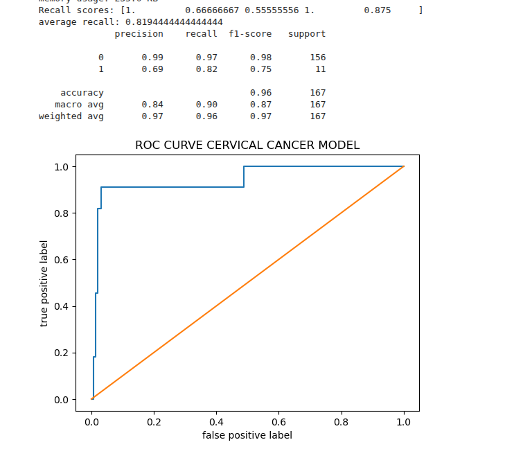

   CERVICAL CANCER PREDICTION USING MACHINE LEARNING
   OVERVIEW
This project focuses on predicting the likelihood of cervical cancer using machine learning techniques.

A dataset obtained from kaggle was analyzed and modeled using a random forest classifier to identify patterns associated with 

cancer risk.

    OBJECTIVES

- Perform exploratory data analysis on cervical cancer dataset

-Preprocess and clean the data for modeling

-Train a machine learning model to predict cervical cancer

-Evaluate model performance using ROC-AUC and cross-validation.

     DATASET

- source : kaggkle

- format : CSV

- It contains clinical and behavioral features related to cervical cancer risk

    METHODS
 1. data preprocessing

- Handled missing values

- Encoded categorical variables

- Feature selection and preparation

  2. model

- Algorithm : Random Forest Classifier

- Validation : Cross-validation

- Evaluation metric : ROC-AUC score

 3. results

- Achieved strong predictive performance using Random Forest

- ROC-AUC used to evaluate classification effectiveness

- Cross-validation ensured model robustness and reduced overfitting

 4. Softwares and tools

- python

- pandas, Numpy

- Scikit-learn

- Matplotlib/seaborn(visualization)

 project structure

cervical-cancer/
  
  cervical_cancer.ipynb
  
  README.md

  requirements.txt

   * how to run

1. Clone the repository

 git  clone https://github.com/Queenchemutai/machine-learning/cervical_cancer.ipynb.git

2. Install dependencies

 pip install -r requirements.txt

3. run the notebook or script

 jupyter notebook

  future improvements

- Compare multiple models (SVM, Logistic Regression, XGBoost)

- Perform feature importance analysis

- Deploy model as a web application

       Author
 Chemutai Queen

 Msc Molecular Biology $ Bioinformatics

